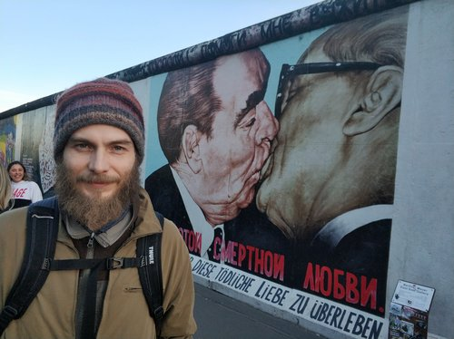

# Резюме

Акинин Олег

33 года, родился 10 августа 1987

- Проживаю: Санкт-Петербург
- Желаемая должность: Тимлид
- Занятость: проектная работа, частичная занятость, полная занятость
- График работы: удаленная работа, гибкий график, полный день

## Контакты

- Телефон: +7-(999)-49529xx
- Telegram: https://t.me/kicumkicum
- Mail: kicumkicum@gmail.com
- LinkedIn: http://linkedin.com/in/kicumkicum
- GitHub: https://github.com/kicumkicum

## Рабочий опыт

Опыт работы: 8 лет 2 месяца

### [Siemens](https://www.siemens.ru) Санкт-Петербург

Ноябрь 2020 — настоящее время 4 месяца

Инженер-исследователь, Team-lead

- Разработка плана перевода проекта с Angular.js на React
- Улучшение кодовой базы и инфраструктуры проекта (линтинг, тесты)
- Менторинг
- Код-ревью

### [Okko](https://okko.tv) Санкт-Петербург

Июль 2020 — Октябрь 2020 4 месяца

Ведущий разработчик

Программирование, код-ревью

### [HtmlAcademy](https://htmlacademy.ru) Санкт-Петербург

Сентябрь 2018 — Июль 2020 1 год 11 месяцев

Автор курсов по программированию, лид

- Разработка новых курсов, поддержка существующих.
- Менеджмент дизайнеров, верстальщиков учебных проектов.
- Написание ТЗ. Программирование проектов. Разработка инструментов.
- Чтение лекций. Взаимодействие с пользователями.

### [SPBTV](https://ru.spbtv.com) Санкт-Петербург

Март 2018 — Сентябрь 2018 7 месяцев

Web-разработчик

Написание нового кода, поддержка старого, ревью.

### [Interfaced](https://interfaced.tv) Томск

Январь 2013 — Март 2018 5 лет 3 месяца

Web-разработчик, Team-lead

Рабочие проекты

- Имплементация абстракций-адаптеров для работы ZombieBox с различными SmartTV платформами
- Сопровождение репозиториев этих абстракций: подготовка релиза, ревью кода, составление roadmap
- Persik.tv - SmartTV приложение для просмотра ТВ и VOD - поддержка и добавление новых фич
- Виртуальные окна Kaleva - программно-аппаратное решение для объединения нескольких ТВ в "видео стену"
- Dom.ru 2.0 - SmartTV портал для просмотра ТВ, VOD, контента с внешних устройств и тд - поддержка и реализация новых фич, планирование спринтов, внедрение Scrum

## Обо мне

Я люблю программировать, взаимодействовать с людьми, менторить и воодушевлять их. А также создавать интересные и полезные продукты. Поэтому жду от работы задачах в этих областях. Мне нравится реализовать бизнес-задачи, сохраняя и повышая качество кодовой базы. Люди - главная ценность, поэтому я стараюсь поддерживать дружную атмосферу в команде, развивать ответственность и компетенции всех участников, чтобы разработка двигалась вперёд быстрее и быстрее.

Мне нравится развивать продукт, выстраивать процессы, упрощать коммуникацию, а так же воодушевлять коллег на подвиги и свершения. Обладаю выдержкой для получения результата даже в самых пожароопасных ситуациях. Если у вас есть планы по захвату мира, то давайте реализуем их вместе!

### Мой путь

В программирование пришел в начале 2013 года. Устроился в компанию Interfaced тестировщиком. Через год перешел на должность JS-программиста.

В компании высокие требования к коду, поэтому в своей работе я использую ООП, строгую типизацию, компиляцию с помощью Google Closure Compiler, код-ревью. Пробовал TypeScript, классная штука :) Компания специализируется на SmartTV приложениях, почти все проекты из себя представляли SPA, написанные на чистом JavaScript с использованием фреймворка ZombieBox.

С весны 2017 года исполнял обязанности тимлида. Еще будучи разработчиком продвигал на проекте идеи Скрама. Убедил менеджеров со стороны заказчика использовать поинты для оценки задач, спринты для планирования, ретроспективы для анализа продуктивности и, страшно подумать, версионирование в Jira. Не представляю, как они строили планы без этого :)

Кроме того осуществил переход со "стандартной" модели ветвления gitflow на "почти" rebase-flow. Почти, потому что bitbucket-cloud не поддерживает rebase, и мы довольствуемся только squash-мержами. Но даже это позволило сделать историю коммитов чище и понятнее.

В начале 2018 года сменил место работы на SPBTV. Разрабатывал одноименный проект для SmartTV и STB. Стек изменился на более популярную связку React/Redux.

Спустя пол года решил немного изменить вектор и устроился в HTMLAcademy. Теперь я автор профессиональных курсов по JS и React. О нынешних задачах достаточно сложно рассказать в двух словах, но это похоже на разработку высоконагруженного проекта в условиях неопределенности. Перечислю тезисно основные пункты:

Обязанности:
- Разработка новых курсов и их поддержка (два по JS и один по React)
- Разработка ТЗ и домашних учебных проектов
- Реализация учебных проектов с промежуточными состояниями для студентов
- Проведение онлайн-лекций
- Взаимодействие со студентами и наставниками - обработка обратной связи и поддержка
- Разработка серверов для учебных проектов
- Разработка инструментов:
  - Расширение markdown-синтаксиса для ввода переменных, операторов, тестирования, etc.
  - Сборщик демок на основе коммитов в git

Процесс:
- Команда из трех авторов
- Скрам с недельными спринтами
- Сами определили программу - сами реализовали

### Рабочие проекты

- Имплементация абстракций-адаптеров для работы ZombieBox с различными SmartTV платформами
- Сопровождение репозиториев этих абстракций: подготовка релиза, ревью кода, составление roadmap
- Persik.tv - SmartTV приложение для просмотра ТВ и VOD - поддержка и добавление новых фич
- Виртуальные окна Kaleva - программно-аппаратное решение для объединения нескольких ТВ в "видео стену"
- Dom.ru 2.0 - SmartTV портал для просмотра ТВ, VOD, контента с внешних устройств и тд - поддержка и реализация новых фич, планирование спринтов, внедрение Scrum'а
- SPBTV - приложение для просмотра ТВ и VOD-контента

### Некоторые домашние проекты

- https://github.com/kicumkicum/stupid-player - middleware для создания аудио-плеера, выполняющее всю грязную работу со звуком в node.js
- https://github.com/torrent-proxy/bt-stream - torrent-качалка на нодовксих стримах (node.js stream)
- https://github.com/kicumkicum/bond - расширение для Хрома, связывающий тикеты в Redmine с пулл-реквестами и ветками в Bitbucket

Другие проекты так же можно посмотреть на https://github.com/kicumkicum и https://github.com/torrent-proxy

## Образование

- Неоконченное высшее
- Национальный исследовательский Томский государственный университет, Томск, 2007
- ФПМК, Прикладная информатика (по областям)

### Знание языков

- Русский — Родной
- Английский — B2 — Средне-продвинутый

### Навыки

JavaScript; Scrum; Atlassian Jira; Mercurial; ООП; HTML; HTML5; Веб-программирование; Web Application Development; Teamleading; Agile Project Management; Git; HTTP; Smart TV; TypeScript; Google Closure Compiler; Node.js; Linux; Bash; React; Redux
